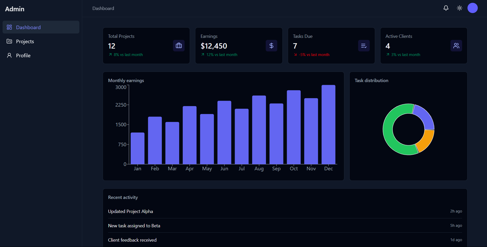
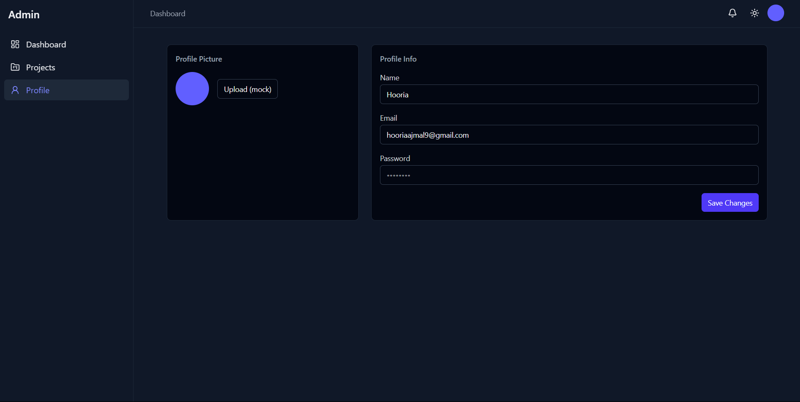
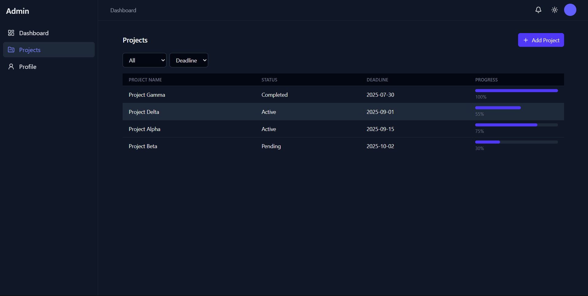

# Multi-Page Dashboard  

A modern, responsive dashboard application built with **React**, **Vite**, and **Tailwind CSS**. This dashboard features a clean design, reusable components, and multiple pages including **Dashboard**, **Profile**, and **Projects**.  


## 🚀 Features  

- **Responsive Design**: Mobile-first approach using Tailwind CSS  
- **Sidebar Navigation**: Persistent navigation with active link highlighting  
- **Reusable Components**: Buttons, Cards, Modals, and Chart containers  
- **Charts & Data Visualization**: Integrated chart components for analytics  
- **Multi-Page Layout**: Dashboard, Profile, and Projects pages  
- **Clean UI**: Header with user options and sidebar layout system  
- **Fast Performance**: Powered by Vite for lightning-fast dev and builds  

## 📸 Screenshots  

- Dashboard Overview  

- Profile Page  

- Projects Page  


## 🛠️ Tech Stack  

- **Frontend Framework**: React 19.x  
- **Build Tool**: Vite 7.x  
- **Styling**: Tailwind CSS 4.x  
- **Linting**: ESLint 9.x  
- **Language**: JavaScript (JSX)  

## 📋 Prerequisites  

Before running this project, make sure you have:  

- **Node.js** (>= 16)  
- **npm** (or yarn)  

Check versions:  

```bash
node --version
npm --version
```

## 🚀 Getting Started  

### 1. Clone the Repository  

```bash
git clone https://github.com/hooriaajmal/multipage-dashboard.git
cd multi-page-dashboard
```

### 2. Install Dependencies  

```bash
npm install
```

### 3. Start the Development Server  

```bash
npm run dev
```

The app will be available at `http://localhost:5173` (or another available port).  

### 4. Build for Production  

```bash
npm run build
```

This generates a `dist` folder with optimized production files.  

### 5. Preview Production Build  

```bash
npm run preview
```

## 📁 Project Structure  

```
multi-page-dashboard/
├── public/                 # Static assets
│   └── vite.svg
├── src/
│   ├── assets/             # Images and icons
│   ├── components/         # Reusable UI components
│   │   ├── Button.jsx
│   │   ├── Card.jsx
│   │   ├── ChartContainer.jsx
│   │   └── Modal.jsx
│   ├── data/               # Mock data
│   │   └── mock.js
│   ├── layout/             # Layout components
│   │   └── DashboardLayout.jsx
│   ├── pages/              # Application pages
│   │   ├── Dashboard.jsx
│   │   ├── Profile.jsx
│   │   └── Projects.jsx
│   ├── ui/                 # UI-specific elements
│   │   ├── Header.jsx
│   │   └── Sidebar.jsx
│   ├── App.jsx             # Main application component
│   ├── App.css             # App-specific styles
│   ├── index.css           # Global styles
│   └── main.jsx            # Application entry point
├── index.html              # HTML template
├── package.json            # Dependencies and scripts
├── vite.config.js          # Vite configuration
├── tailwind.config.js      # Tailwind configuration
└── eslint.config.js        # ESLint configuration
```

## 🎯 Available Scripts  

- `npm run dev` → Start development server  
- `npm run build` → Build for production  
- `npm run preview` → Preview production build  
- `npm run lint` → Run ESLint for code quality  

## 🎨 Features in Detail  

### Dashboard  
- Displays charts and data visualization widgets  
- Uses `ChartContainer` for integrating chart libraries  

### Profile  
- Displays user information and settings  
- Extendable for authentication or user management  

### Projects  
- Shows a project list or grid  
- Can be connected to APIs or a backend  

### Layout  
- `DashboardLayout` manages the **Sidebar** and **Header**  
- Sidebar navigation for multi-page routing  

### Components  
- **Button** → Custom reusable buttons  
- **Card** → Clean content display wrapper  
- **Modal** → Popups and dialogs  
- **ChartContainer** → Wraps chart libraries for visualization  

## 📝 Customization  

### Styling  
- Uses Tailwind CSS  
- Modify `tailwind.config.js` for colors, fonts, breakpoints  
- Add or override styles in `src/index.css`  

### Pages  
- Add new pages inside `src/pages`  
- Update sidebar links in `Sidebar.jsx`  
- Define routes in `App.jsx`  

## 🚀 Deployment  

### Deploy to Vercel  
1. Push your repo to GitHub  
2. Connect the repo in [Vercel](https://vercel.com)  
3. Vercel auto-builds and deploys your site  

### Deploy to Netlify  
1. Run `npm run build`  
2. Drag-and-drop the `dist` folder into Netlify  

### Deploy to GitHub Pages  
1. Install gh-pages:  
   ```bash
   npm install --save-dev gh-pages
   ```
2. Add to `package.json`:  
   ```json
   {
     "homepage": "https://hooriaajmal.github.io/multipage-dashboard",
     "scripts": {
       "predeploy": "npm run build",
       "deploy": "gh-pages -d dist"
     }
   }
   ```
3. Deploy:  
   ```bash
   npm run deploy
   ```

## 🤝 Contributing  

1. Fork the repository  
2. Create a feature branch: `git checkout -b feature-name`  
3. Commit changes: `git commit -m 'Add feature'`  
4. Push branch: `git push origin feature-name`  
5. Open a Pull Request  

## 👤 Author  

**Your Name**  
- GitHub: (https://github.com/hooriaajmal)  
- Email: hooriaajmal9@gmail.com  

## 🙏 Acknowledgments  

- [React](https://react.dev/)  
- [Vite](https://vitejs.dev/)  
- [Tailwind CSS](https://tailwindcss.com/)  
- [ESLint](https://eslint.org/)  

---  

⭐ If you find this project useful, please consider giving it a star on GitHub!  
